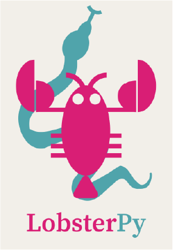

|CI Status| |Documentation Status| |PyPI version| |PyPI downloads| |DOI|

Getting started
===============

   LobsterPy Logo

This is a package that enables automatic plotting of Lobster outputs. You can download Lobster on http://www.cohp.de. Currently, only VASP/Lobster computations are supported.

Installation
------------

You can now use ``pip install lobsterpy`` to install it.

You can also pip install the package in development mode by writing ``pip install -e .``. It will then use setup.py to install the package. One requirement of this package is `pymatgen <https://github.com/materialsproject/pymatgen>`__.

Basic usage
-----------

-  **Automatic analysis and plotting of COHPs:**

   You can use ``lobsterpy description`` for an automated analysis of COHPs for relevant cation-anion bonds or ``lobsterpy automatic-plot`` to plot the results automatically. It will evaluate all COHPs with ICOHP values down to 10% of the strongest ICOHP. You can enforce an analysis of all bonds by using ``lobsterpy automatic-plot --allbonds`` . Currently, the computed Mulliken charges will be used to determine cations and anions. If no ``CHARGE.lobster`` is available, the algorithm will fall back to the BondValence analysis from pymatgen. Please be aware that LobsterPy can only analyze bonds that have been included in the initial Lobster computation. Thus, please use the cohpgenerator within Lobster.

   It is also possible to start this automatic analysis from Python script. See "examples" for scripts.

-  **Command line plotter**:

   We included options to plot COHPs/COBIs/COOPs from the command line. ``lobsterpy plot 1 2`` will plot COHPs of the first and second bond from ``COHPCAR.lobster``. It is possible to sum or integrate the COHPs as well (``--summed``, ``--integrated``). You can switch to COBIs or COOPs by using ``--cobis`` or ``--coops``, respectively.

-  **Other command line tools**:

   ``lobsterpy create-inputs`` will create standard inputs based on existing POSCAR, POTCAR, INCAR files. It will allow to test for different basis sets that are available in Lobster. Currently only available for PBE\_54 POTCARs.

-  **Further help?**

   You can get further information by using ``lobsterpy --help`` and also by typing ``lobsterpy description --help``, ``lobsterpy automatic-plot --help``, ``lobsterpy plot --help``

How to cite?
------------

Please cite our preprint: https://doi.org/10.26434/chemrxiv-2022-2v424. Please cite `pymatgen <https://github.com/materialsproject/pymatgen>`__, `Lobster <https://www.cohp.de>`__, and `ChemEnv <https://doi.org/10.1107/S2052520620007994>`__ correctly as well.

Future plans:
-------------

-  Include automatic plotting for COBIs/COOPs
-  Include orbitals into automatic plotting

Contributions
-------------

-  Contributions and suggestions for features are also welcome. Please write an Issue to describe your potential contribution or feature request.

.. |CI Status| image:: https://github.com/JaGeo/LobsterPy/actions/workflows/python-package.yml/badge.svg
.. |Documentation Status| image:: https://readthedocs.org/projects/lobsterpy/badge/?version=latest
   :target: https://lobsterpy.readthedocs.io/en/latest/?badge=latest
.. |PyPI version| image:: https://badge.fury.io/py/lobsterpy.svg
   :target: https://badge.fury.io/py/lobsterpy
.. |PyPI downloads| image:: https://img.shields.io/pypi/dm/lobsterpy?style=flat&color=blue&label=pypi%20downloads
   :target: https://pypi.org/project/lobsterpy
.. |DOI| image:: https://zenodo.org/badge/343384088.svg
   :target: https://zenodo.org/badge/latestdoi/343384088
