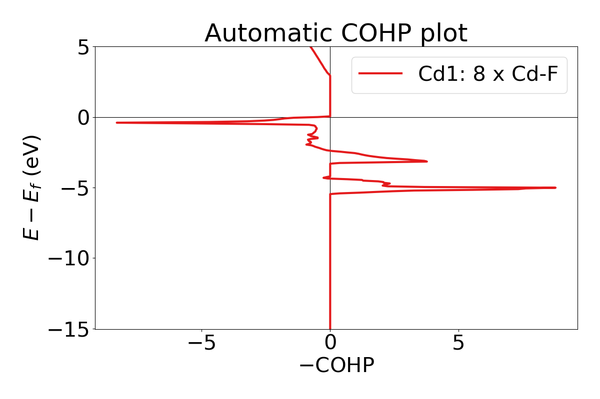
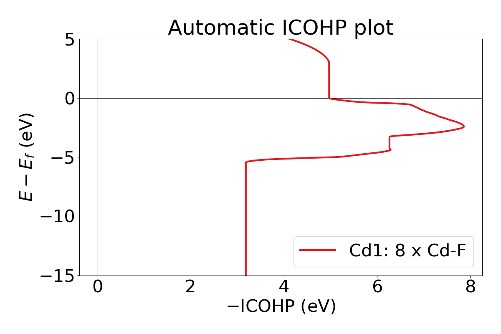
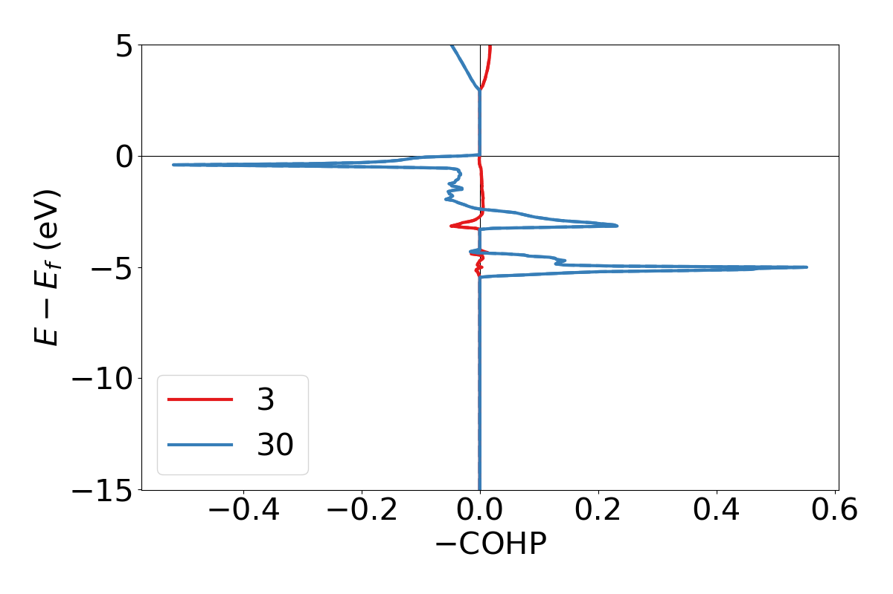
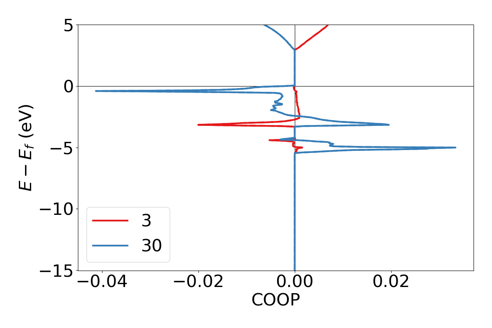
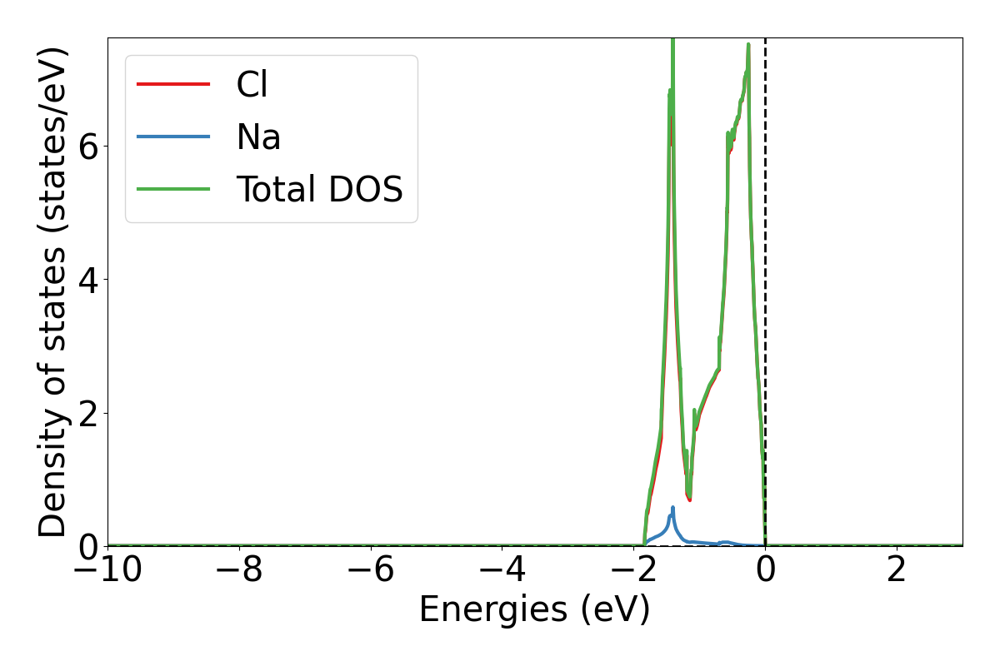
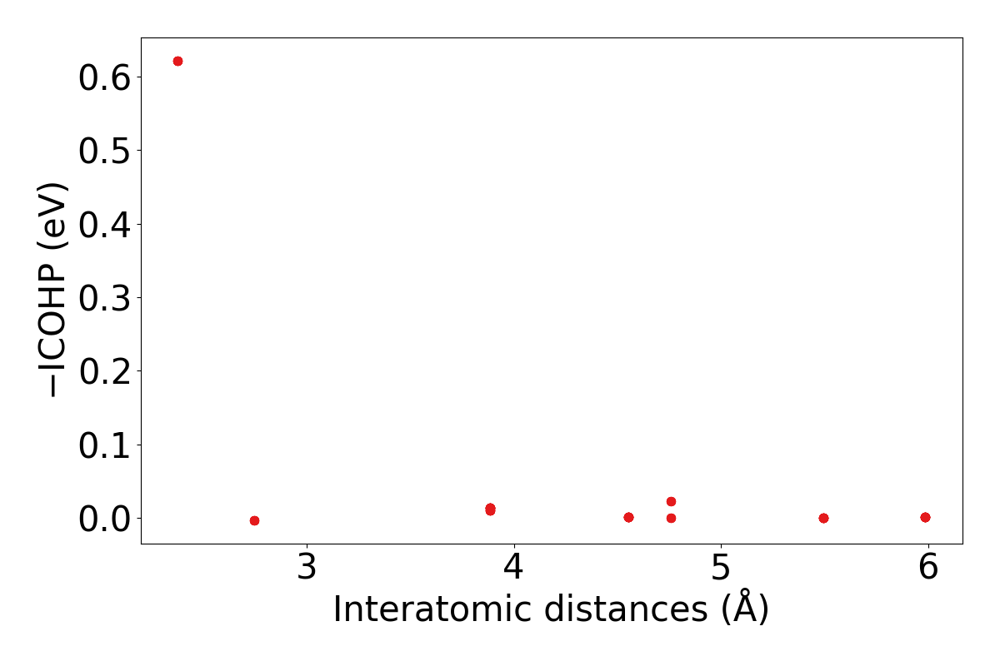

Command line interface
======================

Creating input files
--------------------

.. note::
   
   Important tags in INCAR of VASP to pay attention to before performing lobster runs are NBANDS, NSW, and ISYM. A VASP static run must be performed (no movements of atoms, NSW = 0) before running the LOBSTER program. LOBSTER can only deal with VASP WAVECAR that contains results for the entire mesh or only half of it.
   
   To do this, in the INCAR set, `ISYM = -1` (complete mesh/symmetry switched off) or `ISYM = 0` (half mesh/time-reversal). And to make sure WAVECAR is written, set `LWAVE = .TRUE`. For pCOHP analyses, one needs to have as many bands as there are orbitals on a local basis.
   
   For pCOHP analyses using LOBSTER, however, you need to set NBANDS in the INCAR file manually.
   

With LobsterPy, these intricate details are handled with a single command. We need the standard VASP input files, i.e. 
``INCAR, KPOINTS, POTCAR and POSCAR`` in the calculation directory. Once you have these files, one needs to run the following command:

``lobsterpy create-inputs``

The above command will create input files (INCAR and lobsterin) depending on the basis sets available in Lobster.

The NBANDS, NSW, and ISYM tags will be changed in the existing INCAR file, and new INCAR files will be written in the current directory. 
The newly created INCAR file will be named ``INCAR.lobsterpy`` by default.  
Simultaneously, ``lobsterin.lobsterpy`` files are created that are necessary for a lobster run (this is the file that instructs the LOBSTER program what computations must be performed).

You can also change the names of output files and path where they are saved using following optional tags:

``lobsterpy create-inputs --incar-out <path/to/incar>/INCAR --lobsterin-out <path/to/lobsterin>/lobsterin``

For example if ``Cd`` element has two basis sets ``4d 5s`` ``4d 5s 5p``, thus following files are created:

.. code:: bash

   INCAR.lobsterpy-0
   INCAR.lobsterpy-1
   lobsterin.lobsterpy-0
   lobsterin.lobsterpy-1
   

The suffix “-0” & “-1” indicate input files corresponding to smaller and larger basis of ``Cd`` respectively.

.. warning::
     
         The ‘KPOINTS’ file is not adapted; the user must select the appropriate grid density before starting VASP computations. Usually, a factor of 50 x reciprocal lattice vectors is sufficient for reliable bonding analysis results.

Running VASP and Lobster program
--------------------------------

Before we start computations, it is important to organize the files in
separate directories to avoid overwriting our results. So Let's create
two new directories named **Basis_0** and **Basis_1.**

1. Copy ‘INCAR.lobsterpy-0, KPOINTS, POSCAR, POTCAR,
   lobsterin.lobsterpy-0’ files to **Basis_0**
2. Copy ‘INCAR.lobsterpy-1, KPOINTS, POSCAR, POTCAR,
   lobsterin.lobsterpy-1’ files to **Basis_1**
3. Rename ‘INCAR.lobsterpy-\*’ to ‘INCAR’ and ‘lobsterin.lobsterpy-\*’
   to lobsterin in *both* the directories (\* denotes 0 or 1)
4. Run VASP using the job submission script to your job scheduler on HPC
   .Eg: ``sbatch submit.sh``
5. Wait for VASP computation to be finished.(Lobster program needs
   WAVECAR generated by VASP)
6. Now run the lobster program.

The sample job scripts for slurm job scheduler are provided below.

VASP job submission script

.. code:: bash

   #!/bin/bash -l
   #SBATCH -J vasp_job
   #SBATCH --no-requeue
   #SBATCH --export=NONE
   #SBATCH --get-user-env
   #SBATCH -D ./
   #SBATCH --ntasks=144
   #SBATCH --time=04:00:00
   #SBATCH --partition=micro
   #SBATCH --nodes=3
   #SBATCH --output=vaspjob.out.%j
   #SBATCH --error=vaspjob.err.%j

   <path-to-vasp-bin>/vasp_std

--------------

Lobster job submission script

.. code:: bash

   #!/bin/bash -l
   #SBATCH -J lob_job
   #SBATCH --no-requeue
   #SBATCH --export=NONE
   #SBATCH --get-user-env
   #SBATCH -D ./
   #SBATCH --ntasks=48
   #SBATCH --time=04:00:00
   #SBATCH --nodes=1
   #SBATCH --output=lobsterjob.out.%j
   #SBATCH --error=lobsterjob.err.%j

   export OMP_NUM_THREADS=48

   <path-to-lobster-bin>/lobster-4.1.0

--------------

Analyze the lobster outputs with automation
-------------------------------------------

.. code:: python

    import os
    os.chdir('Basis_0/') # Navigate to directory containing the files of lobster runs

1. Automatic analysis and plotting of COHPs/ICOHPs
~~~~~~~~~~~~~~~~~~~~~~~~~~~~~~~~~~~~~~~~~~~~~~~~~~

-  The ``lobsterpy description`` command will automatically analyze COHPs for relevant cation-anion bonds. This command also   allows saving the output in a JSON file. Below is an example output of this command.

.. code:: bash

   lobsterpy description --json description.json

.. code:: bash
   
   The compound CdF2 has 1 symmetry-independent cation(s) with relevant cation-anion interactions: Cd1.
   Cd1 has a cubic (CN=8) coordination environment. It has 8 Cd-F (mean ICOHP: -0.62 eV, 27.843 percent antibonding interaction below EFermi) bonds.

Following is the json file produced.

.. code:: json

   {
     "formula": "CdF2",
     "max_considered_bond_length": 5.98538,
     "limit_icohp": [
       -100000,
       -0.1
     ],
     "number_of_considered_ions": 1,
     "sites": {
       "0": {
         "env": "C:8",
         "bonds": {
           "F": {
             "ICOHP_mean": "-0.62",
             "ICOHP_sum": "-4.97",
             "has_antibdg_states_below_Efermi": true,
             "number_of_bonds": 8,
             "bonding": {
               "integral": 7.93,
               "perc": 0.72157
             },
             "antibonding": {
               "integral": 3.06,
               "perc": 0.27843
             }
           }
         },
         "ion": "Cd",
         "charge": 1.57,
         "relevant_bonds": [
           "29",
           "30",
           "33",
           "40",
           "53",
           "60",
           "63",
           "64"
         ]
       }
     },
     "type_charges": "Mulliken"
  }

-  ``lobsterpy calc-description --potcar-symbols "Na_pv Cl" --bvacomp --doscomp`` command will automatically analyze your lobster calculation quality.
   
.. note::
   The LOBSTER calculation directory need to have POTCAR, POSCAR, LOBSTER calculation input and output files to run the **lobsterpy calc-description** command successfully. 
   If POTCAR is not available then you need to supply **--potcar-symbols** along with the command. Other optional files are vasprun.xml if **--doscomp** is switched on.

.. code:: bash

   lobsterpy calc-description --potcar-symbols "Na_pv Cl" --bvacomp --doscomp --calcqualityjson calc_quality_description.json

.. code:: bash
   
   The LOBSTER calculation used minimal basis. The absolute and total charge spilling for the calculation is 0.3 and 5.58 %, respectively. The projected wave function is completely orthonormalized as no
   bandOverlaps.lobster file is generated during the LOBSTER run. The atomic charge signs from Mulliken population analysis agree with the bond valence analysis. The atomic charge signs from Loewdin
   population analysis agree with the bond valence analysis. The Tanimoto index from DOS comparisons in the energy range between -5, 0 eV for s, p, summed orbitals are: 0.9785, 0.9973, 0.9953.

-  ``lobsterpy automatic-plot`` command will plot the results
   automatically. It will evaluate all COHPs with ICOHP values down to
   10% of the strongest ICOHP. You can enforce an analysis of all bonds
   by using ``lobsterpy automatic-plot --allbonds``. Currently, the
   computed Mulliken charges will be used to determine cations and
   anions. If no CHARGE.lobster is available, the algorithm will fall
   back to the BondValence analysis from pymatgen. Please be aware that
   LobsterPy can only analyze bonds that have been included in the
   initial Lobster computation. Below is an example and sample output
   using this command.

.. code:: bash

   lobsterpy automatic-plot --title 'Automatic COHP plot' --save-plot COHP.png
   

You can also plot integrated ICOHP computed by lobster by turning on
``--integrated`` flag when executing ``lobsterpy automatic-plot``
command. Below is an example and sample output using this command.

.. code:: bash

   lobsterpy automatic-plot --title 'Automatic ICOHP plot' --integrated --save-plot ICOHP.png
   

-  ``lobsterpy automatic-plot-ia`` command can be used to obtain a interactive plot of analysis automatically. It will evaluate all COHPs with ICOHP values down to 10% of the strongest ICOHP. You can enforce an analysis of all bonds by using ``lobsterpy automatic-plot-ia --allbonds``. Currently, the computed Mulliken charges will be used to determine cations and anions. If no CHARGE.lobster is available, the algorithm will fall back to the BondValence analysis from pymatgen. Please be aware that LobsterPy can only analyze bonds that have been included in the initial Lobster computation. You can also obtain a label resolved plot for all bonds using the ``lobsterpy automatic-plot-ia --allbonds --label-resolved`` command. Below is an sample output using ``lobsterpy automatic-plot-ia --label-resolved`` command.
   
.. raw:: html
   :file: tutorial_assets/CdF2.html

2. Plotting of COHPs/COBIs/COOPs
~~~~~~~~~~~~~~~~~~~~~~~~~~~~~~~~

You can plot COHPs/COBIs/COOPs from the command line.

``lobsterpy plot 3 30`` will plot COHPs of the first and second bond from COHPCAR.lobster. It is possible to sum or integrate the COHPs as well (–summed, –integrated). You can switch to COBIs or COOPs by using `--cobis` or `--coops`, respectively. Below is an example output of command to plot COHP and COOP for bond labels 3 and 30.

.. code:: bash

    lobsterpy plot 3 30 --save-plot COHP_330.png

.. code:: bash

    lobsterpy plot 3 30 --coops --save-plot COOP_330.png

3. Plotting of DOS
~~~~~~~~~~~~~~~~~~~

-  ``lobsterpy plot-dos --summedspins`` will plot total and element DOS. Example output plot is shown below.

.. code:: bash

   lobsterpy plot-dos --summedspins

4. Plotting of ICOHPs/ ICOOPs/ICOBIS againsts bond lengths
~~~~~~~~~~~~~~~~~~~~~~~~~~~~~~~~~~~~~~~~~~~~~~~~~~~~~~~~~~~~

-  ``lobsterpy plot-icohps-distances`` will plot ICOHPs against bond lengths. Example output plot is shown below.

.. code:: bash

    lobsterpy plot-icohps-distances

5. Additional Options
~~~~~~~~~~~~~~~~~~~~~

You can also customize the style and parameters of the plots generated
by using optional tags. One can easily get an overview of these using
either of these commands:

.. code:: bash

   lobsterpy automatic-plot --help

.. code:: bash

   lobsterpy automatic-plot-ia --help

.. code:: bash

   lobsterpy calc-description -help

.. code:: bash

   lobsterpy create-inputs --help

.. code:: bash

   lobsterpy description --help

.. code:: bash

   lobsterpy plot-dos --help

.. code:: bash

   lobsterpy plot-icohps-distances --help

.. code:: bash

   lobsterpy plot --help

